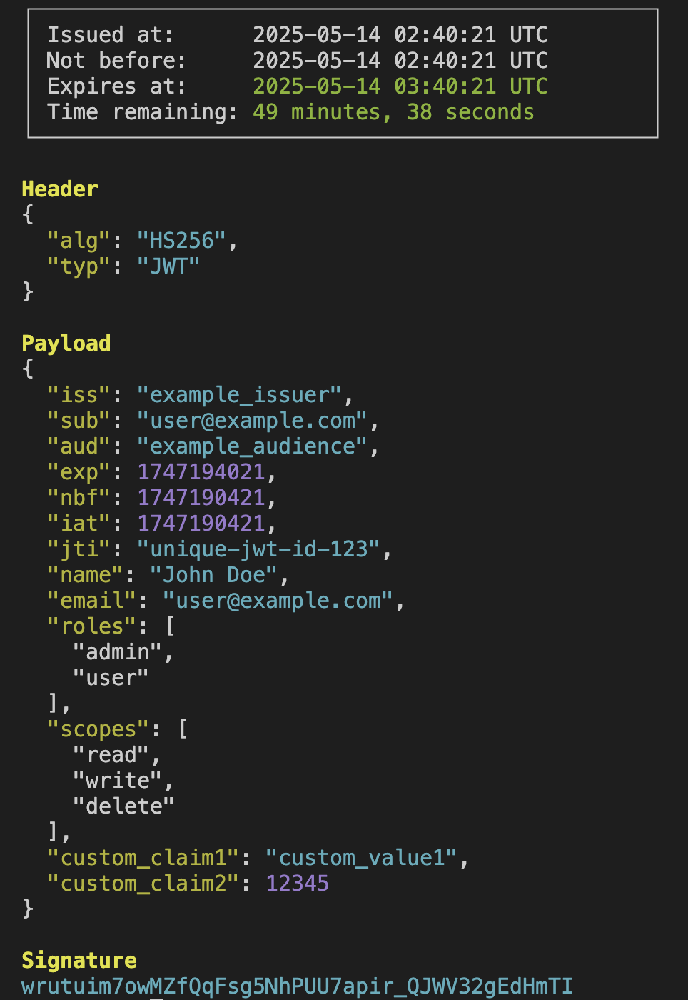

# Your JWT Swiss Army Knife

`cjwt` is a robust and comprehensive command-line tool — your Swiss Army knife for all things JWT. Featuring intuitive commands for generating, validating, decoding, and inspecting JSON Web Tokens, cjwt streamlines token management tasks for developers and security professionals across both development and production environments.



## Installation

```bash
brew install cjwt
```

## Quick Start

The simplest way to use `cjwt` is to copy a JWT to your clipboard and run:

```bash
cjwt
```

This will automatically decode and display the JWT in a beautiful, colorized format.

## Features

`cjwt` is your complete JWT toolkit. Here are some of the powerful features:

### 1. JWT Creation

Create new JWTs with custom claims and signing:

```bash
# Create a JWT with custom claims
cjwt create --claims '{"sub": "123", "name": "John Doe"}' --secret "your-secret"

# Create a JWT with expiration
cjwt create --claims '{"sub": "123"}' --exp 3600 --secret "your-secret"
```

### 2. JWT Validation

Validate JWTs against public keys or secrets:

```bash
# Validate a JWT with a secret
cjwt validate --token "your.jwt.token" --secret "your-secret"

# Validate with a public key
cjwt validate --token "your.jwt.token" --public-key "path/to/public.pem"
```

### 3. JWT Decoding

Decode JWTs in various formats:

```bash
# Decode from clipboard
cjwt

# Decode from file
cjwt decode --file token.txt

# Decode from string
cjwt decode --token "your.jwt.token"
```

### 4. JWT Signing

Sign JWTs with different algorithms:

```bash
# Sign with HS256
cjwt sign --claims '{"sub": "123"}' --secret "your-secret" --alg HS256

# Sign with RS256
cjwt sign --claims '{"sub": "123"}' --private-key "path/to/private.pem" --alg RS256
```

### 5. JWT Verification

Verify JWT signatures and claims:

```bash
# Verify signature and claims
cjwt verify --token "your.jwt.token" --secret "your-secret" --required-claims '["sub", "exp"]'
```

### 6. JWT Header Inspection

Inspect JWT headers:

```bash
# Show only the header
cjwt header --token "your.jwt.token"
```

### 7. JWT Payload Extraction

Extract specific claims from JWTs:

```bash
# Extract specific claims
cjwt extract --token "your.jwt.token" --claims '["sub", "name"]'
```

### 8. JWT Expiration Management

Work with JWT expiration:

```bash
# Check if JWT is expired
cjwt check-exp --token "your.jwt.token"

# Add expiration to existing JWT
cjwt add-exp --token "your.jwt.token" --exp 3600
```

### 9. JWT Format Conversion

Convert between different JWT formats:

```bash
# Convert to compact format
cjwt format --token "your.jwt.token" --format compact

# Convert to JSON format
cjwt format --token "your.jwt.token" --format json
```

### 10. JWT Batch Processing

Process multiple JWTs at once:

```bash
# Process multiple JWTs from a file
cjwt batch --file tokens.txt --action validate --secret "your-secret"
```

## Advanced Usage

### Working with Different Algorithms

```bash
# Create JWT with ES256
cjwt create --claims '{"sub": "123"}' --private-key "path/to/private.pem" --alg ES256

# Create JWT with PS256
cjwt create --claims '{"sub": "123"}' --private-key "path/to/private.pem" --alg PS256
```

### Working with Different Key Formats

```bash
# Use JWK format
cjwt create --claims '{"sub": "123"}' --jwk "path/to/key.jwk"

# Use PEM format
cjwt create --claims '{"sub": "123"}' --pem "path/to/key.pem"
```

## Contributing

Contributions are welcome! Please feel free to submit a Pull Request.

## License

MIT License - feel free to use this tool in any way you want!
